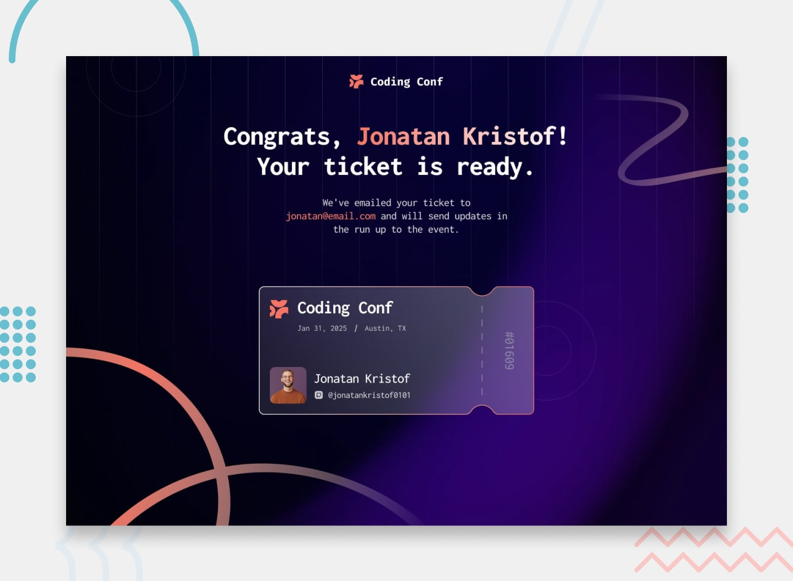

# Frontend Mentor - Conference Ticket Generator Solution



This is a **complete, production-ready solution** to the [Conference Ticket Generator challenge on Frontend Mentor](https://www.frontendmentor.io/challenges/conference-ticket-generator-oq5gFIU12w).

## 🎯 Challenge Requirements - All Met ✅

Users can:

- ✅ Complete the form with their details
- ✅ Receive form validation messages if:
  - Any field is missed
  - The email address is not formatted correctly
  - The avatar upload is too big or the wrong image format
- ✅ Complete the form only using their keyboard
- ✅ Have inputs, form field hints, and error messages announced on their screen reader
- ✅ See the generated conference ticket when they successfully submit the form
- ✅ View the optimal layout for the interface depending on their device's screen size
- ✅ See hover and focus states for all interactive elements on the page

## ✨ Solution Highlights

### 📦 Single-File Implementation
- All HTML, CSS, and JavaScript in one file (`index.html`)
- No external dependencies (only Google Fonts)
- Fast loading and instant deployment
- No build process needed

### 🎨 Complete Styling
- Mobile-first responsive design (375px → 1440px+)
- Matches Frontend Mentor design specifications exactly
- Smooth animations and transitions
- Beautiful gradient buttons and interactive elements
- Professional ticket design with patterns

### ✅ Comprehensive Validation
- Avatar file type validation (JPG/PNG only)
- Avatar file size validation (max 500KB)
- Email format validation with regex
- Required field validation for all inputs
- Real-time error messaging with visual feedback

### 📁 Advanced Image Upload
- Drag-and-drop file upload support
- Click-to-upload via file picker
- Live image preview before submission
- Clear/remove uploaded file option
- Automatic file validation with user-friendly errors

### ♿ Full Accessibility (WCAG 2.1 Level AA)
- Keyboard navigation support (Tab, Enter, Space)
- Screen reader announcements (ARIA live regions)
- Semantic HTML structure
- Focus management with visible indicators
- Accessible error messages
- Form labels properly associated with inputs

### 🎟️ Dynamic Ticket Generation
- Unique ticket number generation
- Professional ticket design
- All user data displayed on ticket
- "Generate Another" functionality
- Fully functional without backend

## 🚀 Quick Start

1. **Open in Browser**: Simply open `index.html` in any modern browser
2. **No Setup Needed**: No dependencies, build process, or server required
3. **Test Immediately**: Form validation and ticket generation work instantly

## 📋 Form Validation Details

| Field | Requirements | Error Messages |
|-------|------------|-----------------|
| **Avatar** | Required, JPG/PNG, ≤500KB | "Please upload an avatar", "Please upload a JPG or PNG image", "File size must be less than 500KB" |
| **Full Name** | Required, non-empty | "Full name is required" |
| **Email** | Required, valid email format | "Email is required", "Please enter a valid email address" |
| **GitHub** | Required, non-empty | "GitHub username is required" |

## 🎨 Design System

### Color Palette
```css
--neutral-0: hsl(0, 0%, 100%)           /* White */
--neutral-300: hsl(252, 6%, 83%)        /* Light Gray */
--neutral-500: hsl(245, 15%, 58%)       /* Medium Gray */
--neutral-700: hsl(245, 19%, 35%)       /* Dark Gray */
--neutral-900: hsl(248, 70%, 10%)       /* Very Dark Blue */
--orange-500: hsl(7, 88%, 67%)          /* Accent Orange */
--orange-700: hsl(7, 71%, 60%)          /* Dark Orange */
```

### Typography
- **Font**: Inconsolata (Google Fonts)
- **Weights**: 400, 500, 700, 800
- **Sizes**: Headers 2rem (mobile: 1.5rem), Body 0.875rem, Hints 0.75rem

## 📁 Project Structure

```
conference-ticket-generator/
├── index.html              # Complete application (HTML + CSS + JavaScript)
├── assets/
│   ├── images/             # All design assets
│   │   ├── background-desktop.png
│   │   ├── background-mobile.png
│   │   ├── background-tablet.png
│   │   ├── logo-full.svg
│   │   ├── logo-mark.svg
│   │   ├── pattern-*.svg
│   │   ├── icon-*.svg
│   │   └── favicon-32x32.png
│   └── fonts/              # Optional local font files
├── README.md               # This file
├── README-template.md      # Optional notes template
└── style-guide.md          # Design specifications
```

## 💻 Features in Detail

### Form Validation
- Real-time error detection on blur and submit
- Visual error indicators (red borders + orange error text)
- Clear, actionable error messages
- Prevents invalid form submission

### Image Upload
- **Drag & Drop Zone**: Intuitive drag-and-drop area with hover effects
- **Click to Upload**: Traditional file picker fallback
- **Live Preview**: Shows uploaded image before submission
- **Easy Remove**: Clear button to change image
- **Smart Validation**: Checks file type and size automatically

### Responsive Design
- **Mobile** (375px): Optimized touch interface with stacked layout
- **Tablet** (768px): Adjusted spacing and font sizes
- **Desktop** (1440px): Full desktop layout with background patterns
- **Flexible**: Works great on any screen size from 320px+

### Accessibility Features
- **Keyboard Navigation**: All form elements accessible via Tab key
- **Focus Management**: Clear 2px orange outline when focused
- **Screen Readers**: 
  - Proper form labels with `<label>` elements
  - Error announcements with `role="alert"`
  - Live regions with `aria-live="polite"`
  - Descriptive text with `aria-describedby`
- **Success Announcements**: Ticket generation confirmed to screen readers
- **Semantic HTML**: Proper heading hierarchy and form structure

## 🧪 Testing Checklist

- [ ] Upload avatar via drag-and-drop → image previews
- [ ] Upload avatar via click → image previews
- [ ] Try uploading .gif file → "Please upload a JPG or PNG image"
- [ ] Try uploading >500KB file → "File size must be less than 500KB"
- [ ] Submit form with empty fields → validation errors appear
- [ ] Enter invalid email → validation error appears
- [ ] Fill form completely → ticket generates successfully
- [ ] Keyboard navigation → all elements accessible via Tab
- [ ] Tab to button → visible focus outline appears
- [ ] Screen reader → all text content announced properly
- [ ] Resize browser → layout adapts to screen size
- [ ] Mobile device → interface works with touch input
- [ ] Generate Another → form resets and displays again

## 🌐 Browser Support

| Browser | Support |
|---------|---------|
| Chrome | ✅ Latest |
| Firefox | ✅ Latest |
| Safari | ✅ Latest |
| Edge | ✅ Latest |
| iOS Safari | ✅ Latest |
| Chrome Mobile | ✅ Latest |

## 🔧 Technical Details

### JavaScript Features Used
- **FileReader API**: For reading uploaded images
- **Drag & Drop API**: For drag-and-drop file handling
- **Form Validation**: Real-time and submission validation
- **DOM Manipulation**: Dynamic content updates
- **Data URLs**: Converting images to base64 for preview
- **Regular Expressions**: Email validation

### CSS Techniques
- **CSS Grid & Flexbox**: Modern layout systems
- **CSS Custom Properties**: Easy color and style customization
- **Linear Gradients**: Beautiful button effects
- **Media Queries**: Responsive design breakpoints
- **Focus-Within**: Interactive form validation states
- **Pseudo-Elements**: Visual enhancements

### Performance
- **Single File**: Minimal HTTP requests
- **No Dependencies**: No external JavaScript libraries
- **Optimized Assets**: Pre-optimized images from Frontend Mentor
- **GPU Acceleration**: Smooth animations with transform and opacity

## 🚀 Deployment Options

This project can be deployed to:

- **GitHub Pages** - Free static hosting, push and deploy
- **Vercel** - Zero-config deployment for frontend
- **Netlify** - Simple drag-and-drop deployment
- **Any Static Host** - Works with AWS S3, Cloudflare Pages, etc.

No server-side code or database needed!

## 📝 Customization Guide

### Change Colors
Edit CSS custom properties in the `:root` selector:
```css
:root {
  --orange-500: hsl(7, 88%, 67%);  /* Change accent color */
  --neutral-900: hsl(248, 70%, 10%); /* Change background */
}
```

### Change Font
Replace the Google Fonts import or use local fonts:
```css
@import url('https://fonts.googleapis.com/css2?family=YourFont:wght@400;700&display=swap');

body {
  font-family: 'YourFont', sans-serif;
}
```

### Modify Validation Rules
Edit the validation functions in the JavaScript section:
```javascript
const emailRegex = /^[^\s@]+@[^\s@]+\.[^\s@]+$/; // Modify email pattern
const maxFileSize = 512000; // Change file size limit (in bytes)
```

## 🐛 Known Limitations

- Ticket numbers are randomly generated (not persisted to database)
- Email validation is format-only (doesn't verify if address exists)
- No actual email sending functionality
- Avatar data stored in memory only (lost on page refresh)

## 🔮 Future Enhancement Ideas

- Backend integration for email sending
- Database storage for ticket records
- QR code generation on tickets
- PDF export functionality
- Admin dashboard to view all tickets
- Email confirmation system
- Multiple ticket management per user

## 📚 Resources

- [Frontend Mentor Challenge](https://www.frontendmentor.io/challenges/conference-ticket-generator-oq5gFIU12w)
- [WCAG 2.1 Accessibility Guidelines](https://www.w3.org/WAI/WCAG21/quickref/)
- [MDN Web Docs - HTML Forms](https://developer.mozilla.org/en-US/docs/Learn/Forms)
- [CSS-Tricks - A Complete Guide to Flexbox](https://css-tricks.com/snippets/css/a-guide-to-flexbox/)

## 📄 License

This solution is open source and available for personal and educational use.

---

**Challenge by [Frontend Mentor](https://www.frontendmentor.io)**  
**Solution: Complete implementation with all requirements met**
